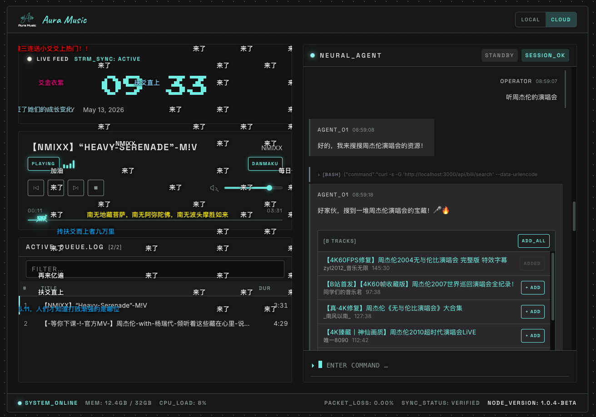

<p align="center">
  
</p>

[](https://creativecommons.org/licenses/by-nc-sa/4.0/)
[](https://nodejs.org/)

AI Agent 驱动的 B站音频播放器。随时随地，想听就听，不止于音乐。




## Features

- **双模式切换** — 本地曲库搜索 / B站云端搜索，一键切换
- **AI 对话交互** — 通过自然语言告诉 AI 你想听什么，智能搜索推荐
- **B站视频转音频** — 云端搜索后自动转换为本地 MP3，构建个人曲库
- **弹幕叠加** — 播放 B站来源的音频时，同步显示原视频弹幕
- **复古终端 UI** — 赛博朋克风格界面，实时状态面板
- **智能文件名解析** — 自动从文件名中提取标题、作者、日期、BV号

## Tech Stack

| 层 | 技术 |
|---|------|
| 框架 | Next.js 16 (App Router) |
| 前端 | React 19 / TypeScript 5 |
| 样式 | Tailwind CSS 4 + CSS Variables |
| AI | @anthropic-ai/claude-agent-sdk（支持 DeepSeek / Claude） |

## Getting Started

### 前置条件

- Node.js >= 20
- pnpm（推荐）或 npm
- AI API Key（推荐 [DeepSeek](https://platform.deepseek.com/api_keys)，也支持 Anthropic Claude）

### 安装

```bash
git clone https://github.com/pstrm-dev/aura-player.git
cd aura-player
pnpm install
```

### 配置环境变量

```bash
cp .env.example .env.local
```

编辑 `.env.local`，填入你的 API Key：

```env
# 推荐使用 DeepSeek（中文能力强、免费额度大）
# 获取 Key: https://platform.deepseek.com/api_keys
ANTHROPIC_BASE_URL=https://api.deepseek.com
ANTHROPIC_API_KEY=your-deepseek-api-key

# 音频存储目录（可选，默认 ~/Documents/bili）
# MUSIC_DIR=/path/to/your/music
```

### 启动

```bash
pnpm dev
```

打开 http://localhost:3000 即可使用。

## Project Structure

```
aura-player/
├── app/
│   ├── api/              # API 路由
│   │   ├── chat/         # AI Agent SSE 接口
│   │   ├── bili/         # B站搜索 & 弹幕代理
│   │   ├── search/       # 本地曲库搜索
│   │   └── tracks/       # 音频文件服务 & 扫描
│   ├── components/       # UI 组件（Atomic Design）
│   │   ├── atoms/
│   │   ├── molecules/
│   │   └── organisms/
│   ├── context/          # React Context（Player/Agent/Mode/Danmaku）
│   ├── hooks/            # 自定义 Hooks
│   └── lib/              # 共享逻辑（bili API、tracks 解析、类型）
├── docs/screenshots/     # 应用截图
├── public/               # 静态资源
└── design/               # 设计规范文档
```

## Usage

### 本地模式

搜索 `MUSIC_DIR` 目录下的 MP3 文件。支持按标题、作者、文件名模糊匹配。

### 云端模式

1. 切换到 CLOUD 模式
2. 告诉 AI 你想听什么（如"听周杰伦的演唱会"）
3. AI 在 B站搜索相关视频并推荐
4. 点击 ADD 转换为音频，自动加入播放列表
5. 转换后的音频保存在本地，下次可在本地模式直接搜索

## Platform

| 平台 | 支持情况 |
|------|---------|
| macOS | 完全支持 |
| Linux | 完全支持 |
| Windows | 需要 WSL（云端转换依赖 bash 命令） |

## 赞赏

如果这个项目对你有帮助，欢迎请作者喝杯咖啡 :)

<p align="center">
  
</p>

## License

本项目采用 [CC BY-NC-SA 4.0](LICENSE) 协议。

你可以自由地查看、修改和分享本项目代码，但 **禁止用于商业用途**。衍生作品须以相同协议分发。
